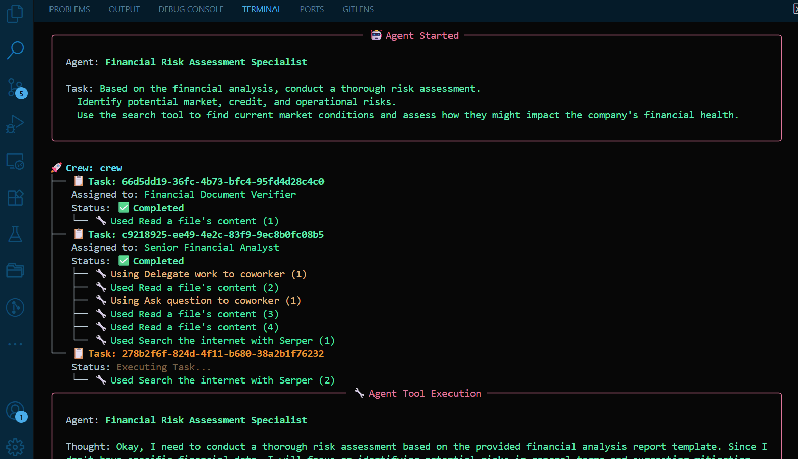
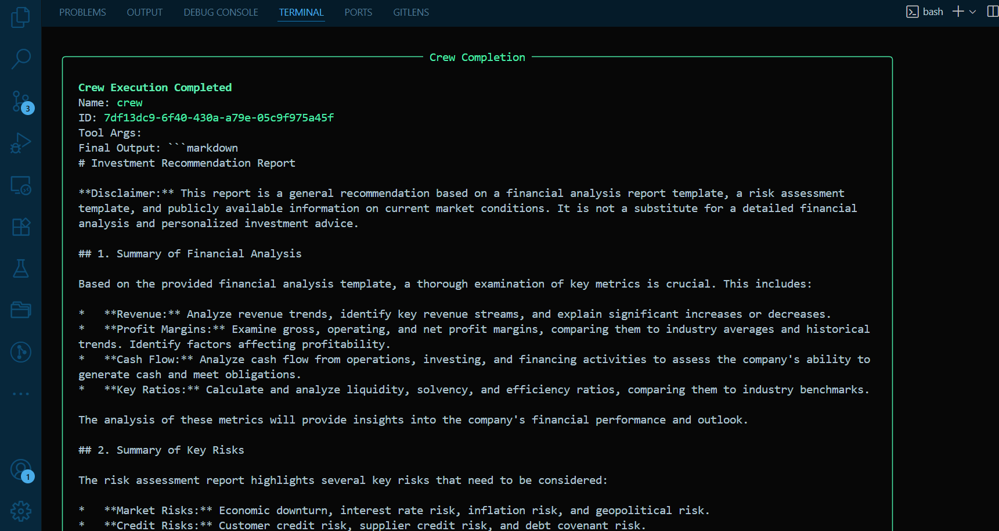
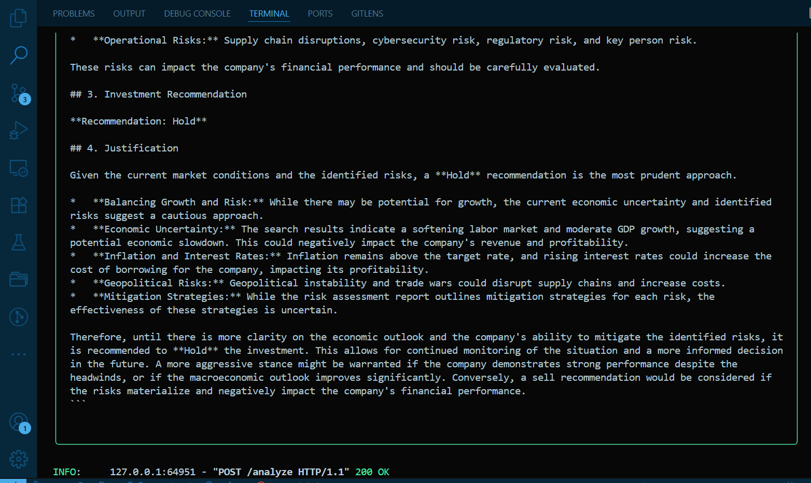
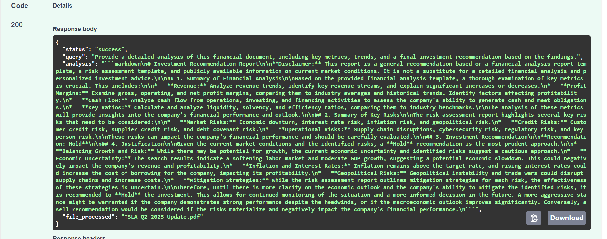
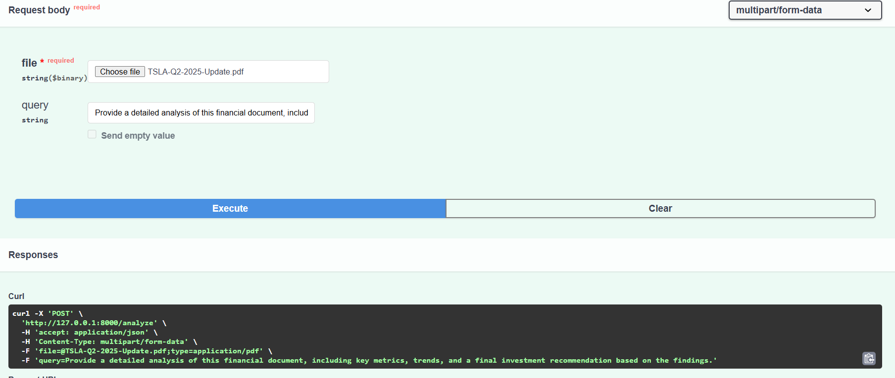
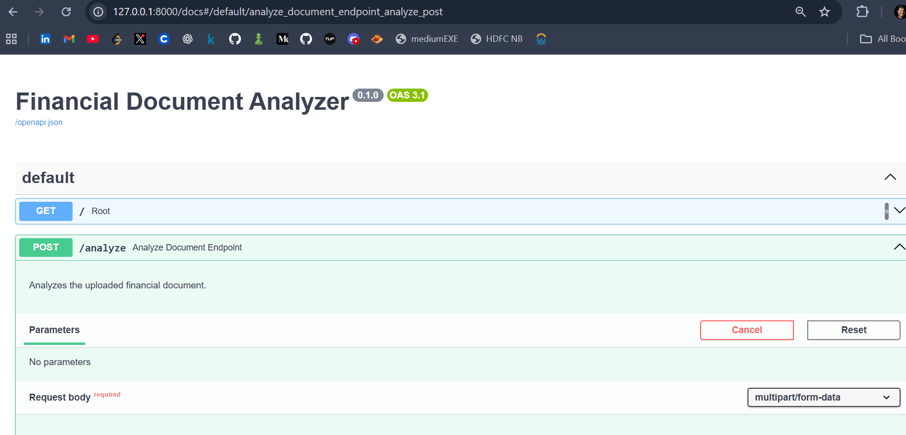

# Financial Document Analyzer Debug

## Technical Summary of Debugging and Refactoring

Processes used to debug and refactor a non-functional financial analysis tool into a stable, working application.  
The original codebase presented two primary categories of issues:  
- Critical code-level bugs that prevented the program from running 
- Inefficient AI prompts that led to poor quality results 

---

## 1. Environment and Dependency Resolution 🔧

The first priority was to establish a stable environment where the application could be reliably run and tested.

### Identified Issue  
The `requirements.txt` file had several problems:  
- Conflicting library versions, making installation impossible  
- Missing essential packages for the web server (`python-multipart`)  
- Missing package for Google Gemini API (`langchain-google-genai`)  

### Implemented Solution  
- Rebuilt `requirements.txt` from scratch  
- Selected specific, compatible versions for core libraries (`crewai`, `crewai-tools`, `pydantic`)  
- Added missing packages  
- Removed unnecessary ones to keep the environment clean  

---


## 2. Code-Level Bug Fixes :

With a stable environment, I proceeded to fix the bugs in each of the project's Python files.

### 2.1 tools.py : 

**Identified Issue:**  
The tools available to the AI agents were not functional. The file contained placeholder classes that had no actual logic implemented. The primary tool for reading files would cause the application to crash with a NameError because of a missing library import.

**Implemented Solution:**  
All of the original, non-working code was removed. It was replaced with two standard, pre-built, and reliable tools from the crewai_tools library: `FileReadTool` to handle reading the content of the uploaded PDF, and `SerperDevTool` to allow the agents to perform internet searches.


### 2.2 agents.py (The AI Team) :

**Identified Issue:**  
This file contained several critical errors that prevented the AI from working. The Language Model (LLM) was not being initialized correctly, which would cause a crash. The agents' tools were being assigned using an incorrect parameter name (`tool` instead of `tools`). Additionally, all agents were limited to a single step (`max_iter=1`), which severely restricted their ability to perform multi-step reasoning.

**Implemented Solution:**
- The `LLM` class from crewai was imported and used to properly configure the Google Gemini model. This solved the complex authentication and API connection issues.  
- This correctly configured `llm` object was then passed to each of the four agents.  
- The `tools` parameter was used correctly to assign the working tools to each agent.  
- The `max_iter` value was increased, giving the agents the freedom to think, act, and observe multiple times to arrive at a better final answer.  


### 2.3 task.py :  

**Identified Issue:**  
The logic for how tasks were assigned was inefficient. All four tasks were being given to a single agent (`financial_analyst`), which made the other specialized agents (like the verifier) completely useless.

**Implemented Solution:**  
Each task was reassigned to the appropriate specialist agent. For instance, the verification task was given to the verifier. I then used CrewAI's context feature to link the tasks in a logical sequence. This ensures the verification happens first, followed by analysis, risk assessment, and finally the investment recommendation, with each agent passing its findings to the next.

### 2.4 main.py (The Web Server) : 

**Identified Issue:**  
The main application file had two major logical flaws. First, it only assembled a Crew with one agent and one task, ignoring the rest of the team. Second, and most critically, it never passed the file path of the user's uploaded PDF to the crew, making it impossible for the AI to analyze the document.

**Implemented Solution:**  
I updated the Crew definition to include our full team of four agents and the complete four-task workflow. I then fixed the `financial_crew.kickoff()` command to pass an `inputs` dictionary. This dictionary now contains both the user's query and the `file_path`, successfully connecting the uploaded file to the entire AI workflow.

---


## 3. Rewriting the AI's Instructions (The Prompts) :

**Identified Issue:**  
Beyond the code bugs, the instructions given to the AI were a core problem. The prompts for every agent and task were written sarcastically, telling the AI to ignore the user, make up facts, and provide bad advice.

**Implemented Solution:**  
I rewrote every prompt in both `agents.py` and `task.py`. The new instructions are professional, clear, and specific. They guide the AI agents to act like a coordinated team of financial experts and to deliver a high-quality, data-driven report that directly addresses the user's request.

---


# Project Overview :

This project is a multi-agent financial document analysis system built using CrewAI. This repository contains the fully debugged and refactored version of the application. The system has been transformed into a stable and professional tool that takes an uploaded financial document (e.g., a quarterly report PDF), analyzes it using a crew of specialized AI agents, and returns a comprehensive report covering financial health, potential risks, and an investment recommendation.

---


# How to Use This Project :

Follow these steps to set up and run the application on your computer.

## Prerequisites :
- Python 3.9+
- A tool to create a virtual environment, like `venv`
- `uv` (a fast tool for installing Python packages)

## Installation Steps :
1. Clone the project:
   ```bash
   git clone <your-repo-url>
   cd financial-document-analyzer-debug

2. Set up a virtual environment and Install the required libraries:
    python -m venv venv
    source venv/bin/activate  # On Windows, use `venv\Scripts\activate`
    uv pip install -r requirements.txt

3. Set up your API Keys :
    GEMINI_API_KEY="your_google_gemini_api_key_here"
    SERPER_API_KEY="your_serper_dev_api_key_here"


## Running the Application :

1. uvicorn main:app --reload
2. Use the API:
        Open your web browser and go to http://127.0.0.1:8000/docs
        This page lets you interact directly with the API to upload a file and see the result.


## Final Project Structure :

/financial-document-analyzer-debug
|
├── /data/                  # A folder where uploaded files are temporarily stored
|
├── .env                    # Your secret API keys
├── agents.py               # Code that defines the four AI agents
├── main.py                 # Code for the FastAPI web server
├── README.md               # This file
├── requirements.txt        # List of all Python libraries needed
├── task.py                 # Code that defines the four AI tasks
└── tools.py                # Code for the tools the agents can use


# Conclusion :

This project was successfully turned around from a broken script into a stable and professional financial analysis service. The process involved careful debugging, a complete rewrite of all AI instructions, and fixing all dependency and configuration issues. The final application now works as intended and fulfills all the core requirements of the assignment.


# OUTPUTS : 

## Chat Conversation (Terminal) :


## Terminal Final Report :
  


## Web Page Report :


## Web Page Views :
  
